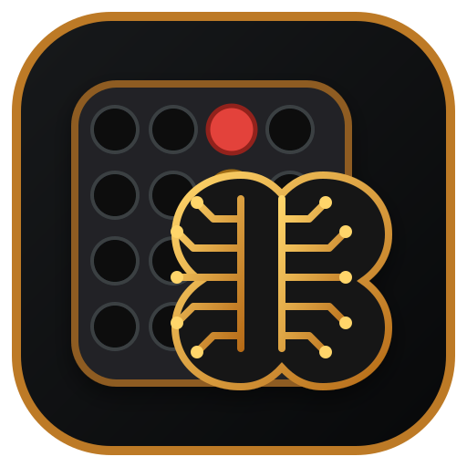

<p align="center">
  
</p>

<h1 align="center">Connect4 AI</h1>

<p align="center">
  A minimalist, fully offline Connect Four Android game with local two-player
  play, strong AI, undo, animated interactions, and best-move prediction.
</p>

<p align="center"><strong>Created and maintained by Kier Estanislao (Dopan).</strong></p>

## Features

- Play against Easy, Medium, Hard, or Perfect AI
- Local two-player pass-and-play
- Best-move Prediction Mode using a hollow-chip marker
- Fast preliminary prediction followed by exact background verification
- Undo that understands both two-player and player-versus-AI turns
- Minimalist menu-driven UI with chip-drop and sheet animations
- Fully offline gameplay: no account, server, analytics, or network permission
- Proper Android launcher, round, adaptive, and Android 13+ monochrome icons
- Android 16-compatible, fully packaged Android project using package `com.connect.fourai`

## Build the APK

The repository includes a GitHub Actions workflow. Open **Actions**, run
**Build Android APK**, and download the `Connect4-AI-APK` artifact.

For a local build, prepare the offline React assets first, then build the Android app:

```bash
cd web
npm install
npm run prepare:android
cd ..
gradle :app:assembleDebug
```

The installable file is generated at:

```text
app/build/outputs/apk/debug/app-debug.apk
```

## Signing note

The GitHub Actions workflow creates an installable **debug APK** for testing and
sideloading. Android Studio and GitHub Actions sign debug builds automatically.
For long-term releases and seamless updates, configure a private release keystore
through GitHub Actions secrets rather than committing a signing key to this public
repository.

## How the solver works

The standard board has 7 columns and 6 playable rows. The solver stores each
column in 7 bits rather than 6: six playable cells plus one sentinel bit. The
whole position therefore fits inside 49 bits of a 64-bit integer.

### 1. Bitboard representation

Let:

- $P$ be the bitboard containing the stones of the player to move.
- $M$ be the occupancy mask containing every stone on the board.
- $B_c = 2^{7c}$ be the bottom bit of column $c$.
- $B = \sum_{c=0}^{6} B_c$ be the bottom-row mask.
- $G$ be the mask of all 42 playable cells.

Every legal landing square can be generated at once with:

$$
\mathrm{Possible}(M) = (M + B) \land G.
$$

The addition carries upward inside each 7-bit column until it reaches the
first empty cell. A move in column $c$ is applied using:

$$
P' = P \oplus M,
$$

$$
M' = M \lor (M + B_c).
$$

The XOR changes the point of view from the current player to the opponent,
while the mask addition inserts the new chip at the lowest free cell.

### 2. Constant-time win detection

Four connected chips can occur vertically, horizontally, or diagonally. In
this 7-bit-per-column layout, the corresponding shifts are:

$$
D = \{1, 7, 6, 8\}.
$$

For a player bitboard $X$, each direction $d$ is tested by:

$$
Y = X \land (X \gg d),
$$

$$
\mathrm{Win}_d(X) \iff
Y \land (Y \gg 2d) \neq 0.
$$

Therefore:

$$
\mathrm{Win}(X) =
\bigvee_{d \in D} \mathrm{Win}_d(X).
$$

This checks all horizontal, vertical, and diagonal alignments with only a few
64-bit operations.

### 3. Negamax search

Connect Four is a deterministic, alternating, zero-sum game. A single value
function is enough because one player's gain is the other player's loss:

$$
V(s) = \max_{a \in A(s)} -V\bigl(T(s,a)\bigr),
$$

where $A(s)$ is the set of legal moves and $T(s,a)$ is the position after
move $a$.

A terminal position is scored as win, draw, or loss. Non-terminal nodes are
searched recursively. The best move is:

$$
a^* = \underset{a \in A(s)}{\mathrm{arg\,max}}
\left[-V\bigl(T(s,a)\bigr)\right].
$$

### 4. Alpha-beta pruning

The search keeps a lower bound $\alpha$ and upper bound $\beta$. A branch
is discarded once:

$$
\alpha \geq \beta.
$$

A naive search has worst-case complexity approximately:

$$
O(b^d),
$$

with branching factor $b \leq 7$ and remaining depth $d$. With strong move
ordering, alpha-beta can approach:

$$
O\!\left(b^{d/2}\right)
$$

in the ideal case. Center-first ordering, immediate-win checks, forced-block
logic, and threat scoring improve the practical cutoff rate.

### 5. Transposition table and symmetry

Different move orders can reach the same board. The solver caches evaluated
positions in a transposition table. It also merges horizontally mirrored
positions by using a canonical key:

$$
K(s) = \min\!\left(k(s), k\bigl(\mathrm{mirror}(s)\bigr)\right).
$$

This reduces duplicate work without changing the game-theoretic result.

### 6. Difficulty selection

Perfect difficulty chooses the highest-scoring legal move directly:

$$
a^* = \underset{a}{\mathrm{arg\,max}}\; Q(s,a).
$$

Lower difficulties sample from a temperature-scaled softmax distribution:

$$
\Pr(a_i) =
\frac{\exp\!\left(Q(s,a_i)/\tau\right)}
{\sum_j \exp\!\left(Q(s,a_j)/\tau\right)}.
$$

A higher temperature $\tau$ increases variation. As $\tau \to 0$, the
selection becomes greedy and approaches the Perfect policy.

### 7. Prediction Mode

Prediction Mode uses a two-stage design:

1. An iterative-deepening alpha-beta search returns a strong move within a
   short time budget.
2. A separate exact worker verifies the move in the background.

If request $r_n$ is the newest board analysis, a result is displayed only
when:

$$
r_{\mathrm{returned}} = r_n.
$$

Older worker responses are ignored, preventing a stale hollow-chip marker
from appearing after the player has already chosen another move.

## Why exact search is practical

For a position with remaining depth $d$, the naive move-tree bound is:

$$
N(d) \leq \sum_{i=0}^{d} 7^i = \frac{7^{d+1}-1}{6}.
$$

The real search is far smaller because gravity restricts legal states, immediate wins
and forced blocks eliminate branches, alpha-beta creates cutoffs, mirrored boards share
one canonical key, and the transposition table reuses positions reached by different
move orders.

## Project structure

```text
app/src/main/java/com/connect/fourai/MainActivity.java  Android host
web/                                                  React game and solver source
app/src/main/assets/                                  Generated offline web assets
app/src/main/res/mipmap-anydpi/                       Legacy vector launcher icon
app/src/main/res/mipmap-anydpi-v26/                   Adaptive icon
app/src/main/res/mipmap-anydpi-v33/                   Android 13+ themed icon
app/src/main/res/drawable/                            Foreground and monochrome vectors
.github/workflows/build-apk.yml                       APK build workflow
```

## Privacy

The app is designed to work completely offline and does not request the
Android internet permission.

## Licensing

Project-owned code is available under the MIT License and is copyrighted by
Kier Estanislao (Dopan). Required third-party notices are kept separately in
`THIRD_PARTY_NOTICES.md` and the bundled asset license files.
